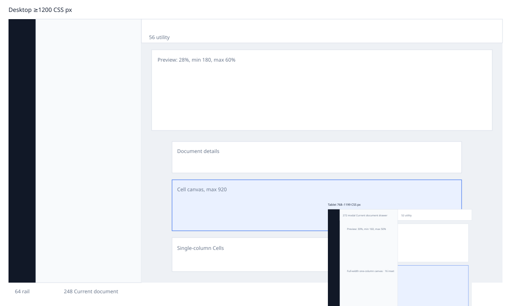

# Authoring workspace redesign

Canonical implementation contract for issue #23. Closed decisions #15–#22 are authoritative when this document is silent. The production UI must use the repository vocabulary in [`CONTEXT.md`](../../CONTEXT.md).

## Scope and information architecture

One ephemeral **Current document** contains stable-identity **Cells**. The dark application rail contains only Author, service health, and the applicable session action. The light Current document navigation contains one static `This session` row, search, a derived Cell outline, and Add Cell. It has no project, persistence, multi-document, or per-Cell execution affordance.

Reading order: skip links → application navigation → Current document navigation → utility bar → Document preview → Document details → Cell canvas → contextual complementary surfaces. CSS must not reorder this sequence.

## Tokens and fixed geometry

| Token | Value |
| --- | --- |
| `nav`, `nav-raised`, `canvas`, `surface`, `border` | `#111827`, `#202b3c`, `#eef1f5`, `#fff`, `#d7dee8` |
| `text`, `muted`, `accent`, `accent-surface` | `#162033`, `#5f6b80`, `#2563eb`, `#eaf1ff` |
| `success`, `stale`, `error` | `#16825b`, `#9a530f`, `#b42318` |
| UI / Source type | system sans 14/1.4; system mono 12/1.55 desktop, 11/1.55 tablet |
| spacing | 4, 8, 12, 16, 24, 32 px |
| radii | 6 px controls; 8 px panels and Cells |
| focus | 2 px accent outline with 2 px separation; focused Cell `#8eb0ed` plus `#dce8ff` outer emphasis |
| layers | base 0; sticky 10; scrim 20; panel 30; modal 40; announcement 50 |
| motion | drawer 160 ms ease; zero under reduced motion |
| desktop | rail 64; sidebar 248; utility 56; canvas max 920 plus 24 px inset |
| tablet | rail 56; drawer 272; utility 52; 16 px canvas inset |

Desktop is ≥1200 CSS px. Tablet is 768–1199. Product support below 768 is out of scope, but existing workflows reflow without workspace-level two-dimensional scrolling to 320 CSS px for WCAG zoom.

## Component contracts

### Current document navigation

Labels derive from first heading, prose, or directive, with `Untitled Cell` fallback. Identity never derives from label or ordinal. Search covers label, Source, and Pending Description but filters only the outline. The outline has one roving tab stop; arrows move, Enter focuses the Cell, and Escape clears search. Insert focuses the new Cell; move preserves Cell focus; delete focuses following, then preceding, then Add Cell. Undo restores complete Cell state, position, and identity.

Desktop navigation is persistent. Tablet navigation is a modal drawer beside the rail, with complete content, scrim/Escape/Close dismissal, containment, and trigger focus restoration.

### Cell editor and Draft Gate

Source and Description are tabs over one editor surface. A Cell never carries front matter: it belongs to the Current document, is authored only in Document details, and any front-matter block found in a Cell's Source — an applied AI draft, which the service returns as a complete document, or a pasted document — is removed from that Cell without touching Document details. Each Cell owns `Last-applied Source` and `Pending Description`. AI submits only explicit non-empty Description. One document-level generation or proposal may exist. Generation captures owner identity, Description, document revision, and request identity; all Source mutations lock until resolution/cancellation. Cancellation invalidates all later responses and returns to Description.

A source outcome becomes valid, invalid, or stale Draft Gate, and a non-valid proposal shows the compiler's own diagnostics — severity, code, and message — beside the proposed Source so the author can act on them rather than guess. Apply is enabled only for a valid proposal at its captured revision and atomically updates Last-applied Source. Discard leaves Source unchanged and preserves Pending Description. Source or structural mutation stales a surviving proposal permanently. Clarification, refusal, and infrastructure failure are responses, never Draft Gates. Proposal arrival announces but never steals focus.

### Document preview

One manually refreshed preview is shared by inline and expanded dialog. Initial state is `Preview not generated`; no load, Source edit, Theme change, or expansion compiles automatically. A successful Artifact is current only for exact revision and Theme. Changes retain it as persistently `Out of date`. Obsolete responses are ignored. Refresh failure retains any prior Artifact. Invalid Source is `Preview blocked by Source errors` and links to authoritative diagnostics.

Desktop starts at 28%, clamped to 180 px–60%; tablet starts at 30%, clamped to 160 px–50%. Height alone persists in session storage. Pointer resizing and separator keys share clamping: arrows 16 px, Shift+arrows 64 px, Home/End bounds, Enter/double-click reset. Expanded preview uses the same URL/state, traps focus, closes on Escape, and restores the Expand trigger.

### Document controls

Utility bar owns Theme, diagnostics summary, Export, and More. More owns Analyze and Format. Document details owns title, authors, date, and metadata and auto-opens for metadata diagnostics. Diagnostics are grouped by severity then Source order; exact-range activation focuses Source while the desktop dock/tablet sheet remains open.

Format produces reviewable `Formatted Source` with Apply/Discard and never mutates automatically. Export compiles current Source and Theme independently of preview freshness. Supported HTML/SVG/PNG/PDF are enabled from capabilities; unsupported formats remain disabled with a reason. Invalid Source blocks export and opens diagnostics. Service details are progressively disclosed from persistent rail health.

## State and stale-response matrix

| State/event | Guard | Result | Focus / stale rule |
| --- | --- | --- | --- |
| Source edit | no generation lock | revision +1; Last-applied Source updates; preview/proposal stale | focus remains editor |
| Generation start | Description non-empty; no generation/proposal | capture owner/request/revision; mutation lock | invoking control becomes Cancel |
| Generation resolve | request current; owner exists | response panel or Draft Gate | late/cancelled/ownerless ignored |
| Cancel | generation active | invalidate request; unlock; Description retained | Description editor |
| Apply | valid proposal and exact revision | atomic Source update; ordinary analysis; preview stale | applied change in Source editor |
| Structural mutation | unlocked | revision +1; proposal/preview stale | deterministic target described above |
| Preview resolve | request, revision, Theme current | replace shared Artifact; current | obsolete response ignored |
| Preview fail | request current | retain prior Artifact; persistent recovery | no focus movement |
| Theme change | any | preview stale | no automatic refresh |
| Format resolve | exact revision | review proposal | stale result ignored |
| Analyze resolve | exact revision | authoritative diagnostics | stale result ignored |

## Keyboard, semantics, and accessibility

WCAG 2.2 AA applies at desktop, tablet, and 320 CSS px reflow. Named landmarks, unique names, native controls, no positive `tabindex`, visible 2 px focus, 24×24 minimum WCAG targets (32 desktop, 44 tablet), status text independent of color, forced-colors borders, and reduced-motion immediacy are required. Menus use arrows/Home/End/Enter/Space/Escape and restore triggers. Dialogs contain focus and restore exact triggers. Diagnostics dock/sheet is a non-modal complementary region. The loaded iframe is one Tab stop with state in its title. Routine outcomes use one polite live region; assertive alerts are limited to failures requiring immediate action.

Required keyboard-only workflows: mode switch; generation/cancellation; Draft Gate review; preview refresh/resize/expand; diagnostics navigation; format; export; search/drawer; Cell insertion, movement, deletion, and Undo.

## Deterministic fixtures

- **Minimum:** empty Current document and one empty Cell.
- **Typical:** 4 Cells: heading/prose, equation directive, callout with prose, Unicode table; valid metadata; one Pending Description.
- **Stress:** 30 Cells, duplicate and long labels, one 100 KiB Cell, empty Source, long unbroken token, Unicode, mixed directives, long metadata and Pending Description, and 40 diagnostics across severities.

## Acceptance criteria

| ID | Given / When / Then | Evidence |
| --- | --- | --- |
| NAV-01 | Given one Current document, when navigation renders, then no project/persistence/multi-document controls exist. | DOM and screenshots |
| NAV-02 | Given duplicate labels and reordered Cells, when navigating/mutating, then stable identity selects the intended Cell. | state test + keyboard walkthrough |
| NAV-03 | Given a Source/Pending Description query, when searching, then only the outline filters and match origin is exposed. | browser walkthrough |
| CELL-01 | Given insert/move/delete, when invoked by keyboard, then focus follows the specified target and Undo restores complete state. | state test + walkthrough |
| CELL-02 | Given a Cell Source carrying a front-matter block (an applied draft or a pasted document), then the Cell keeps only the body and Document details is unchanged. | unit test + browser scenario |
| DRAFT-01 | Given explicit Description, when generation starts/cancels, then mutation locks and every late result is ignored. | state test + browser scenario |
| DRAFT-02 | Given valid/invalid/stale proposals, when Apply is considered, then only exact-revision valid Source can apply. | state test |
| DRAFT-03 | Given Apply/Discard, then Last-applied Source and Pending Description follow the component contract. | state test |
| PREVIEW-01 | Given load/edit/Theme/expand, then no automatic compilation occurs. | request log walkthrough |
| PREVIEW-02 | Given current and obsolete responses, then only exact revision+Theme updates the Artifact. | state test |
| PREVIEW-03 | Given failure with a previous Artifact, then it remains visible and stale with recovery. | browser scenario |
| PREVIEW-04 | Given separator input, then pointer and all specified keys clamp and persist height only. | browser walkthrough |
| DOC-01 | Given metadata diagnostics, then Document details expands and diagnostics navigate exact Source. | browser scenario |
| FORMAT-01 | Given a format result, then Source changes only after Apply. | browser scenario |
| EXPORT-01 | Given stale preview and valid Source, then export compiles current Source+Theme, not preview bytes. | service request evidence |
| A11Y-01 | Given desktop/tablet/320 layouts, then semantic order, named landmarks, contrast, focus, reflow, motion, and forced colors meet the contract. | automated scan + manual checks |
| A11Y-02 | Given each essential workflow, then keyboard-only completion has no focus loss or unintended trap. | Chromium/Safari walkthrough |

## Verification matrix and evidence index

Required viewport captures: 1440×900, 1200 boundary, 1199 boundary, 1024×768, 768×1024, 767 boundary reflow check, and 320 CSS px zoom reflow. Run minimum, typical, and stress fixtures. Record browser screenshots, request/state walkthroughs, automated accessibility output, keyboard Chromium/Safari, VoiceOver/Safari, and NVDA/Windows when available. Unavailable NVDA coverage is an explicit gap, never a pass.

Recorded captures: `acceptance/workspace/workspace-{1440x900,1200x900,1199x900,1024x768,768x1024,767x1024,320x800}.png`, plus `workspace-1024x768-drawer-open.png` and the 200 % zoom reflow `workspace-zoom200-720x900.png`.

| Decision | Sections | IDs | Planned evidence |
| --- | --- | --- | --- |
| #15 state model | Cell editor; state matrix | DRAFT-01–03 | reducer tests; generation walkthrough |
| #16 specification contract | all | all | traceability review |
| #17 composition | IA; tokens | NAV-01, A11Y-01 | desktop captures |
| #18 navigation | navigation | NAV-01–03, CELL-02 | keyboard/search/stress |
| #19 controls | document controls | DOC-01, FORMAT-01, EXPORT-01 | operation walkthroughs |
| #20 preview | preview; state matrix | PREVIEW-01–04 | stale/failure/resize/modal scenarios |
| #21 responsive | tokens | A11Y-01 | boundary captures |
| #22 accessibility | keyboard/accessibility | A11Y-01–02 | scans and manual assistive-technology evidence |

## Observed evidence

Recorded 2026-09-28 against headless Chromium (CDP) driving the real service with a stubbed authoring provider. Captures live in `acceptance/workspace/`. Every row names what was observed, not what was planned.

| ID | Observation |
| --- | --- |
| NAV-01 | The rendered navigation contains one static `This session` row, search, outline, and Add Cell; no new/open/save/recent/project control exists in the DOM. |
| NAV-02 | Two Cells sharing the label `Duplicate label` kept distinct outline entries, and clicking the second focused that Cell. |
| NAV-03 | Searching `Thermal` and a Source/Pending-Description term filtered the outline only (3 and 1 entries) while all 14 Cells stayed rendered; Escape cleared the query. |
| CELL-01 | Insert focused the new Cell, move preserved the moved Cell's editor focus, delete focused the following Cell and exposed Undo, and Undo restored the Cell, its position, and its focus. |
| CELL-02 | An applied draft titled `Pythagorean Theorem` showed only `:::: equation …` in the Draft Gate and left only that body in the Cell, with Document details still reading `Document basics` / `AzeForge examples`; pasting the same block into a Cell removed it on blur and announced the removal, while a thematic break with prose between dashes was kept. `test/unit/front-matter.test.mjs` covers the split and strip, including the service's `buildSourceDraft` output. |
| DRAFT-01 | Clicking Generate locked Source, Add Cell, and document fields, kept outline navigation available, and returned to Description with focus on Cancel; the late stub result produced no proposal. |
| DRAFT-02 | A Source edit while a valid proposal was shown moved it to `stale` in place, disabled Apply, and kept editor focus. Against the real compiler, a draft that mislabelled `a^2 + b^2 = c^2` as the chemistry `formula` block rendered `Draft Gate · invalid` with `error · azeforge.chemistry.formula#chem-formula-syntax Formula character "a" does not parse: expected an element symbol or parenthesized group.` and Apply disabled; the same body under the `equation` family rendered valid with Apply enabled. |
| DRAFT-03 | Apply replaced Source with the proposed text and focused the Source editor; Discard restored Description mode with the same Last-applied Source and preserved Pending Description. |
| PREVIEW-01 | Loading, Source edits, Theme changes, and modal expansion issued zero `/v1/jobs` requests; only Refresh compiled. |
| PREVIEW-02 | Reducer tests reject obsolete request, revision, and Theme responses; the browser retained the current Artifact across edits. |
| PREVIEW-03 | A refresh whose Source carried `STUB:INVALID` reported `Preview blocked by Source errors`, exposed the diagnostics action, and kept the previous Artifact. |
| PREVIEW-04 | Arrow keys moved the separator by 16 px, End/Home clamped to 540/180 px, and reload restored the stored height (212 px) with no Artifact. |
| DOC-01 | An analysis diagnostic inside the front matter auto-opened Document details, populated field-local feedback, and its diagnostic action focused the metadata field. |
| FORMAT-01 | Format opened a `Formatted Source` dialog; Source changed only after Apply. |
| EXPORT-01 | Export issued its own compile job with the current Source and Theme and showed `Exporting…` then completion; an invalid Source opened diagnostics and showed `Export failed`. |
| A11Y-01 | At 1440/768/320 no interactive target measured below 24×24 px, no text pair measured below its WCAG AA threshold, `prefers-reduced-motion` collapsed the drawer transition to `0s`, and forced colors applied CanvasText borders. |
| A11Y-02 | A keyboard-only Tab walk (25 stops) never lost focus to `body`; menus, the service dialog, tab lists, the outline, and Cell insertion completed with Escape restoring the exact trigger. |

Evidence gaps, never passes: VoiceOver/Safari and NVDA/Windows passes were not run in this session, and Safari rendering was not exercised. The headless Chromium results above are the only first-hand observations.

## Decision history

Wayfinder #14; generation #15; specification #16; composition #17; navigation #18; controls #19; preview #20; responsive measurements #21; accessibility #22. Primary visual references: commits `19bc888` and `d9e473d`. This specification, not prototype code, is the production contract.
